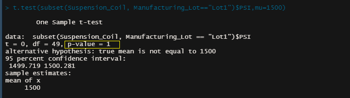

# MechaCar Statistical Analysis

## Overview

AutosRUs’ newest prototype, the MechaCar, is suffering from production troubles that are blocking the manufacturing team’s progress.
The purpose of this statistical analysis was to analyze a series of datasets from AutosRUs. The goal is to apply an understanding from the statistics and hypothesis testing of the production data for the insight to help the manufacturing team. The team has the raw data, and the first goal is to effectively analyze the data using ETL (Extract, Transform, and Load) process to 

All the statistical analysis and visualizations will be in R programming language using RStudio. The analysis will include visualizations, statistical tests, and interpretation of the results.

## Linear Regression to Predict MPG

The dataset contains MPG test results for 50 prototype MechaCars. The MechaCar prototypes were produced using multiple design specifications to identify ideal vehicle performance. Multiple metrics, such as vehicle length, vehicle weight, spoiler angle, drivetrain, and ground clearance, were collected for each vehicle. 

The Analysis required a multiple linear regression analysis to identify which variables in the dataset predict the MPG for vehicle prototypes. The statistical summary output showed the following:

The variables ground_clearance and vehicle_length (as well as the intercept) are statistically unlikely to provide random amounts of variance to the linear model. These variables have a significant impact on the miles per gallon on the MechaCar prototype. As seen in the image below, a linear regression model run on these variables against figures for MPG returned p-values of 2.60e-12 (2.6 X 10-12) and 5.21e-08 (5.21 X 10-08).

Further, the intercept is also statistically significant, which could mean that the significant features (ground clearance, vehicle length) may need to be transformed or adjusted to help improve the predictive power of the model.

The p-value of the linear model = 5.35e-11 (5.35 X 10-11)  is much smaller than the assumed significance level of 0.05%. Therefore, it can be stated that there is sufficient evidence to reject our null hypothesis, which further indicates that the slope of this linear model is not zero.

The multiple r-squared value of this linear model is 0.7149, meaning that roughly 71% of all MPG predictions will be correct when using this model. Therefore, we can conclude that this linear model predicts the MPG of MechaCar's prototypes effectively.

## Technical Analysis on Suspension Coils

The summary statistics was collected on the pounds per square inch (PSI) of the suspension coils from the manufacturing lots. The summary statistics data frame showed the following:

The mean and median are almost the same (difference 1.22). Hence, we can state that the dataset has a symmetric distribution and zero skewness.

The standard deviation was 7.89. This indicates that the data points are spread out over a large range of values.

The design specifications for the MechaCar suspension coils dictate that the variance of the suspension coils must not exceed 100 PSI. The summary output showed that the overall variance was 62.29 (or 62 pounds) PSI which is below the specified requirement. Therefore, the current manufacturing data meet the design specification. 

## T-Tests on Suspension Coils

One-sample t-tests were performed to determine if all manufacturing lots and each lot individually were statistically different from the population mean of 1500 PSI.

The results of the T-test for the suspension coils for all manufacturing lots showed that they are not statistically different from the population mean of 1500 PSI. 
The p-value = 0.0603.  Assuming the significance level of 0.05%, it can be stated that there was not sufficient evidence to reject our null hypothesis.

### Lot 1

The results of the T-test for the suspension coils for Lot 1 showed that they are not statistically different from the population mean of 1500 PSI. The p-value = 1. A p-value generally is not found to be 1; however, when values on both groups are the same, the p-value becomes 1 (0.99). Assuming the significance level of 0.05%, it can be stated that there was not sufficient evidence to reject our null hypothesis.

### Lot 2

The results of the T-test for the suspension coils for Lot 2 showed that they are not statistically different from the population mean of 1500 PSI. The p-value = 0.6072. Assuming the significance level of 0.05%, it can be stated that there was not sufficient evidence to reject our null hypothesis.

### Lot 3

The results of the T-test for the suspension coils for Lot 3 showed that there is a slight statistically difference from the population mean of 1500 PSI; however, the p-value = 0.04168. Assuming the significance level of 0.05%, it can be stated that there was not sufficient evidence to reject our null hypothesis.

The hypotheses results are:

Null: MechaCar shows similar city and highway fuel efficiency to the AutoRUs based on cylinder class.
Alternative: MechaCar show a higher city and highway fuel efficiency to the AutoRUs based on cylinder class.

To perform these tests a sample of fuel efficiency by cylinder class needs to be gathered for AutoRUs. T-tests should then be completed to show the variance for the populations. The test should then be run by cylinder class to gather even more specific data to provide to the consumer. The metrics should be publicly available for MechaCar as well as the AutoRUs.
